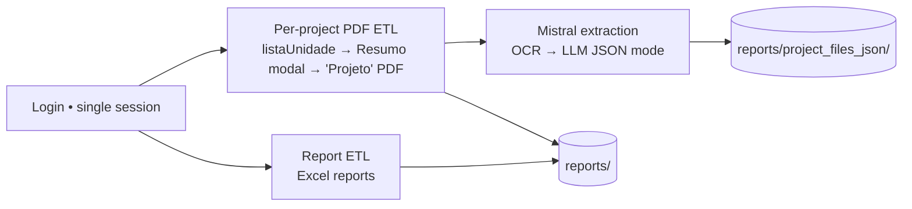

# Sigpesq Agent

Automated agent that logs into the Sigpesq portal (IFES) with **Playwright**, downloads
research data, and turns project PDFs into structured JSON with the **Mistral API**.

## 📋 Objective

With a **single login** (the portal rate-limits logins), the agent runs three stages:

1. **Report ETL (Excel)** — downloads the three report categories:
   - **Research Groups** → `reports/research_group/`
   - **Research Projects** → `reports/research_projects/`
   - **Advisorships** → `reports/advisorships/{year}/` (one file per year)
2. **Per-project PDF ETL** — the **"Projeto"** PDF of every campus project
   (Diretoria → Projetos → do Campus) → `reports/project_files/<code>.pdf`
3. **Extraction (Mistral)** — each PDF → structured JSON
   → `reports/project_files_json/<code>.json` (+ combined `projects.json`)

### Pipeline



### Quickstart

```bash
pip install -e ".[extract]"           # agent + mistralai
playwright install chromium           # browser
cp .env.example .env                  # fill SIGPESQ_USER / SIGPESQ_PASSWORD / MISTRAL_KEY

python agent.py download-everything    # stages 1 + 2, one login
python examples/extract_projects.py    # stage 3 (PDF → JSON)
```

## 🛠️ Technologies

- **Python 3.8+** - Programming language
- **Playwright** - Browser automation framework (async API)
- **Chromium** - Web browser for automation (managed by Playwright)
- **Mistral AI** - OCR + LLM for PDF → structured JSON extraction (optional `[extract]`)
- **python-dotenv** - Environment variable management
- **Pydantic** - Data validation and settings management
- **Design Patterns**: Strategy Pattern, Factory Pattern, Template Method
- **Architecture**: MVC, SOLID principles
- **Documentation**: IEEE 1016 SDD (Software Design Description)

> [!NOTE]
> This library **downloads files** from the Sigpesq portal and **extracts JSON** from the
> project PDFs. It **does not** interact with or save data to any database — all outputs
> (Excel reports, PDFs, JSON) are written to the local filesystem under `reports/`.

## 🏗️ Architecture

The project follows **SOLID**, **MVC**, and **Strategy Pattern** principles:

- **Strategy Pattern**: Each report category has its own download strategy
- **Factory Pattern**: `BrowserFactory` manages Playwright browser contexts
- **Template Method Pattern**: `BasePlaywrightStrategy` defines the skeleton for download operations.
- **IEEE SDD Documentation**: Architecture documented in `docs/sdd.md`

### Folder Structure

```
agent_sigpesq/
├── src/agent_sigpesq/
│   ├── core/
│   │   ├── base_agent.py          # Abstract base class for Agent
│   │   └── browser_factory.py     # Playwright browser-context factory
│   ├── services/
│   │   └── reports_service.py     # Login + download orchestrator
│   ├── strategies/
│   │   ├── report_download_strategy.py     # BasePlaywrightStrategy & Interface
│   │   ├── research_groups_strategy.py     # Research groups strategy (Excel)
│   │   ├── projects_strategy.py            # Projects report strategy (Excel)
│   │   ├── advisorships_strategy.py        # Advisorships strategy (Excel, per year)
│   │   └── project_files_strategy.py       # Per-project "Projeto" PDF strategy
│   └── extraction/
│       ├── schema.py                       # Pydantic project schema
│       └── mistral_extractor.py            # PDF -> JSON (Mistral OCR + chat)
├── examples/                      # Runnable ETL + extraction examples
├── tests/                         # unittest / pytest suite
├── reports/                       # Output directory for downloads
├── agent.py                       # Main CLI entry point
└── requirements.txt               # Python dependencies
```

## 🚀 Installation

### Prerequisites

- Python 3.8+
- Playwright Chromium browser (installed via `playwright install chromium`)
- Sigpesq access credentials

### Step by Step

1. **Clone the repository** (if applicable):
   ```bash
   cd /home/paulossjunior/projects/horizon_project/agent_sigpesq
   ```

2. **Create a virtual environment**:
   ```bash
   python3 -m venv venv
   source venv/bin/activate
   ```

3. **Install dependencies**:
   ```bash
   pip install -e .                 # installs the agent_sigpesq package + deps
   playwright install chromium      # download the Chromium browser Playwright drives
   ```

4. **Configure credentials**:
   ```bash
   cp .env.example .env
   ```
   
   Edit the `.env` file and add your credentials:
   ```env
   SIGPESQ_USER=your_cpf_here
   SIGPESQ_PASSWORD=your_password_here
   ```

## 📖 Usage

### Basic Execution

```bash
python3 agent.py
```

The agent will:
1. Login to Sigpesq
2. Navigate to the reports page
3. Download all reports in the three categories
4. Save files organized by category and year

## 🔄 The two ETLs

The agent ships two independent extract flows:

| ETL | Command | What it downloads | Output |
|-----|---------|-------------------|--------|
| **Reports (Excel)** | `download-all` | Research Groups, Research Projects, Advisorships — via the report buttons on `relatorio/lista.aspx` | `reports/research_group/`, `reports/research_projects/`, `reports/advisorships/<year>/` |
| **Per-project PDFs** | `download-project-files` | The **"Projeto"** PDF of every campus project (Diretoria → Projetos → do Campus) | `reports/project_files/<code>.pdf` |

### Running both ETLs (single login) ⭐

> [!WARNING]
> The SIGPESQ portal **rate-limits logins** (`"Muitas tentativas. Aguarde alguns segundos."`).
> Running the two ETLs as **two separate processes logs in twice** and can trip that limit.
> Run them together in **one login** instead.

```bash
# one command, one login, both ETLs:
python agent.py download-everything            # Excel reports + all ~370 project PDFs
python agent.py download-everything --limit 5  # cap the PDF ETL (quick test)
```

The equivalent programmatic form — a single `SigpesqReportService` logs in once and
reuses the same page for every strategy (project-files **last**, because it navigates
away from the reports page):

```python
import asyncio
from agent_sigpesq.services.reports_service import SigpesqReportService
from agent_sigpesq.strategies import (
    ResearchGroupsDownloadStrategy,
    ProjectsDownloadStrategy,
    AdvisorshipsDownloadStrategy,
    ProjectFilesDownloadStrategy,
)

async def main():
    service = SigpesqReportService(
        headless=True,
        download_dir="reports",
        strategies=[
            ResearchGroupsDownloadStrategy(),   # ETL 1: Excel reports
            ProjectsDownloadStrategy(),
            AdvisorshipsDownloadStrategy(),
            ProjectFilesDownloadStrategy(limit=None),  # ETL 2: PDFs (keep LAST)
        ],
    )
    await service.run()  # ONE login drives BOTH ETLs

asyncio.run(main())
```

### Running each ETL on its own

```bash
python agent.py download-all                    # only the Excel reports
python agent.py download-project-files          # only the PDFs (all projects)
python agent.py download-project-files --limit 10   # only the PDFs, first 10
```

> If you run them as separate commands, **wait a bit between the two** so the second
> login is not rejected by the rate limit.

### Ready-to-run examples

See [`examples/`](examples/) for runnable scripts:

```bash
python examples/run_all_etls.py --limit 5   # both ETLs, one login
python examples/run_reports_etl.py          # Excel only
python examples/run_pdf_etl.py --limit 5    # PDFs only
python examples/run_pdf_etl.py --headful    # watch the browser
```

### CLI reference

```
python agent.py download-all              # all report files (Excel)
python agent.py download-groups           # only Research Groups report
python agent.py download-projects         # only Research Projects report
python agent.py download-advisorships     # only Advisorships reports
python agent.py download-project-files    # per-project "Projeto" PDFs   [--limit N]
python agent.py download-everything       # BOTH ETLs, single login      [--limit N]
```

### Output Structure

After execution, reports will be organized in:

```
reports/
├── research_group/
│   └── Relatorio_DD_MM_YYYY.xlsx
├── research_projects/
│   └── Relatorio_DD_MM_YYYY.xlsx
├── advisorships/
│   ├── 2016/
│   │   └── Relatorio_DD_MM_YYYY.xlsx
│   ├── 2017/
│   │   └── Relatorio_DD_MM_YYYY.xlsx
│   ...
│   └── 2026/
│       └── Relatorio_DD_MM_YYYY.xlsx
└── project_files/               # per-project PDFs (download-project-files)
    ├── PJ_9760.pdf
    ├── PJ_9742.pdf
    └── ...
```

### Headless Mode

By default, the agent runs in headless mode (without graphical interface). To run with a
visible browser (useful for debugging), use the example scripts' `--headful` flag:
```bash
python examples/run_pdf_etl.py --headful --limit 3
```
Or, programmatically, pass `headless=False` to `SigpesqReportService(...)`.

## 🧠 Extracting project data (PDF → JSON via Mistral)

After the PDFs are downloaded, a second step turns each project PDF into structured
JSON using the **Mistral API**. To save API calls, digital PDFs are read **locally**
with `pypdf` (no OCR call); only scanned PDFs (little/no embedded text) fall back to
**Mistral OCR** (`mistral-ocr-latest`). The extracted text then goes to a chat model
(`mistral-large-latest`, JSON mode) that fills a fixed schema. Anything not present in
the PDF is left `null` (the model never invents data). `_meta.fonte_texto` records
whether each project used `pdf-text` or `ocr`.

### Setup

```bash
pip install -e ".[extract]"      # installs mistralai (pinned <2)
# add your key to .env:
#   MISTRAL_KEY=your_mistral_api_key
```

### Run

```bash
python examples/extract_projects.py --limit 5     # test with 5 PDFs
python examples/extract_projects.py               # all downloaded PDFs
```

Outputs (filename follows the project code, matching each PDF):

```
reports/project_files_json/
├── PJ_9760.json          # one JSON per project
├── PJ_9742.json
├── ...
└── projects.json         # combined array of all extracted projects
```

### Extracted fields

`codigo`, `titulo`, `descricao`, `palavras_chave`, `area_conhecimento`,
`linha_pesquisa`, `objetivos` (geral + especificos), `coordenador`
(nome/email/campus/titulacao), `equipe` (nome/funcao/instituicao/carga_horaria),
`datas` (inicio/fim/duracao_meses), `cronograma` (atividade/inicio/fim),
`financiamento` (valor_total/moeda/fontes), and `_meta`
(arquivo, paginas, extraido_em, modelo, `campos_ausentes`).

<details>
<summary>Example output (truncated)</summary>

```json
{
  "codigo": "PJ 9760",
  "titulo": "SIGHUB-IA: Inteligência Adaptativa Multivariável ...",
  "coordenador": {"nome": "Heitor Caroni Nogueira", "email": "heitor@sigmais.com.br", "campus": "Vitória/ES"},
  "equipe": [{"nome": "Oscar Machado de Souza", "funcao": "Cientista de Dados", "carga_horaria_semanal": 14.0}],
  "datas": {"inicio": "2025-01-01", "fim": "2026-12-31", "duracao_meses": 24},
  "financiamento": {"valor_total": 2016851.68, "moeda": "BRL",
    "fontes": [{"fonte": "Subvenção Econômica (FAPES)", "valor": 1310953.66, "tipo": "Pública"}]},
  "_meta": {"arquivo": "PJ_9760.pdf", "paginas": 66, "modelo": "mistral-large-latest", "campos_ausentes": []}
}
```
</details>

> The extraction code lives in [`src/agent_sigpesq/extraction/`](src/agent_sigpesq/extraction/)
> (`schema.py` = pydantic models, `mistral_extractor.py` = OCR + chat pipeline).

## 🛠️ Development

### Adding a New Report Category

1. Create a new strategy in `src/agent_sigpesq/strategies/` (async Playwright):
   ```python
   import os
   from playwright.async_api import Page
   from .report_download_strategy import BasePlaywrightStrategy

   class NewCategoryDownloadStrategy(BasePlaywrightStrategy):
       def get_category_name(self) -> str:
           return "Category Name"

       def get_button_id(self) -> str:
           return "emit_button_id"

       async def download(self, page: Page, reports_dir: str) -> bool:
           button_id = self.get_button_id()

           # 1. Ensure the accordion holding the button is open
           await self._ensure_accordion_open(page, button_id, "Accordion Header Text")

           # 2. Click the button and capture the download, saving it to a subfolder
           target_dir = os.path.join(reports_dir, "new_category_folder")
           return await self._handle_download_and_move(page, f"#{button_id}", reports_dir, target_dir)
   ```

2. Register the strategy in `src/agent_sigpesq/services/reports_service.py`:
   ```python
   self.strategies = [
       ResearchGroupsDownloadStrategy(),
       ProjectsDownloadStrategy(),
       AdvisorshipsDownloadStrategy(),
       NewCategoryDownloadStrategy()  # Add here
   ]
   ```

### Testing

To test only a specific category, create a test script:

```python
import asyncio
from agent_sigpesq.services.reports_service import SigpesqReportService
from agent_sigpesq.strategies import ResearchGroupsDownloadStrategy

async def test():
    service = SigpesqReportService(headless=True, strategies=[ResearchGroupsDownloadStrategy()])
    await service.run()

asyncio.run(test())
```

The `tests/` suite (unittest, run with `pytest`) mocks the Playwright page, so it
needs no browser or network — that is what CI runs on every push/PR.

## 📚 Additional Documentation

- **Architecture**: `docs/sdd.md` (IEEE 1016 Software Design Description)
- **Extension Guide**: `docs/extending_the_agent.md`
- **Project Constitution**: `docs/constitution.md` (Principles and guidelines)

## ⚠️ Troubleshooting

### Login Error

If login fails intermittently:
- Verify that credentials in `.env` are correct (`SIGPESQ_USER` = CPF, `SIGPESQ_PASSWORD`)
- **Rate limit:** the portal rejects rapid re-logins with *"Muitas tentativas. Aguarde alguns segundos."*
  Use a **single login** per run (e.g. `download-everything`) and wait a few minutes
  before retrying — every new attempt resets the cooldown.
- Try running with `--headful` (examples) to visualize the problem

### Downloads not appearing

- Check `reports/` folder permissions
- Ensure there is sufficient disk space
- Check execution logs to identify specific errors

### Browser not installed

Playwright manages its own Chromium. If the browser is missing:
```bash
playwright install chromium
```

## 📄 License

This project follows the guidelines defined in `constitution.md`.

## 👥 Contributing

When contributing, follow SOLID principles and keep the IEEE SDD documentation updated.
