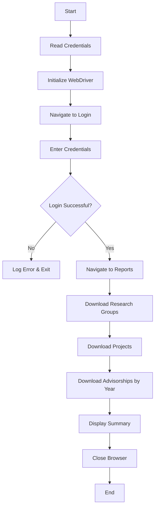
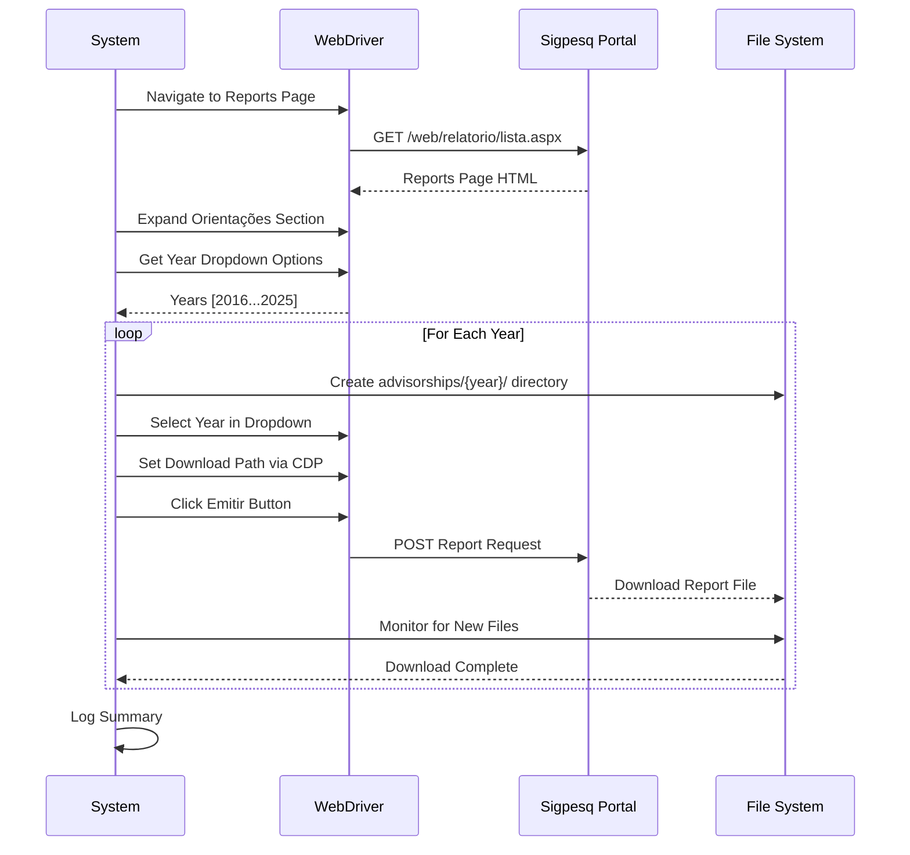
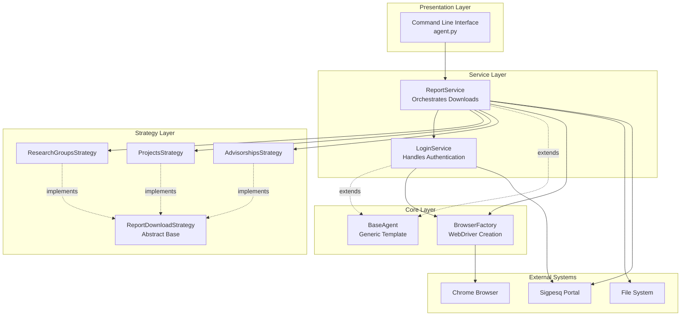
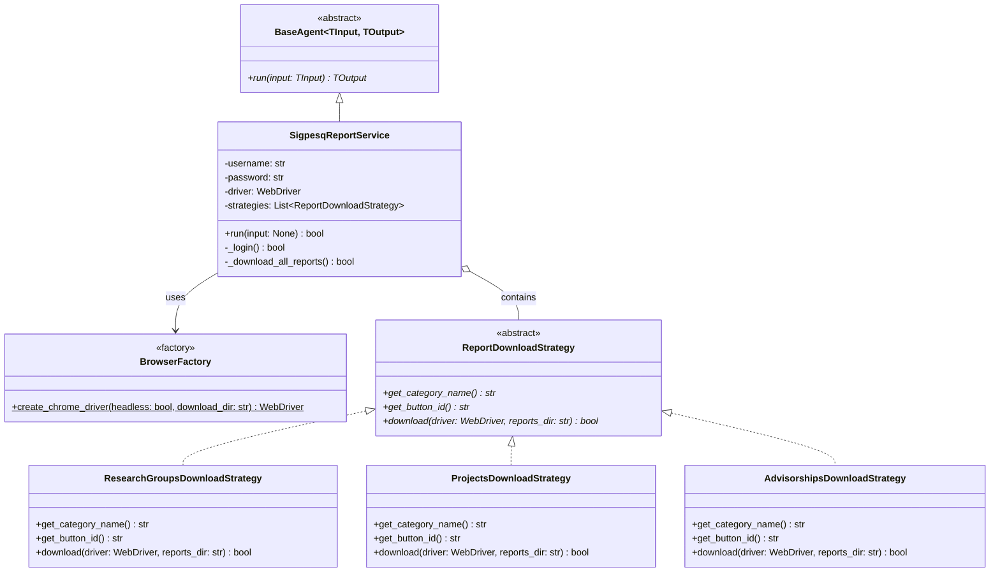
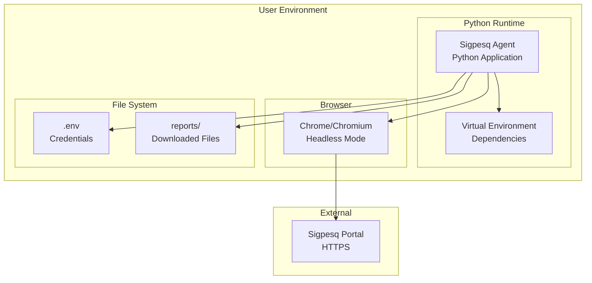
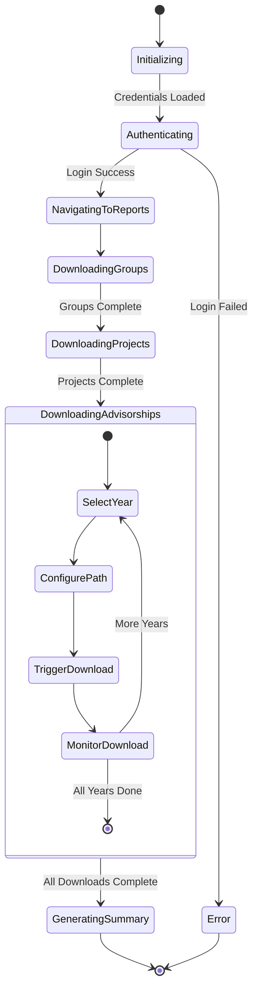
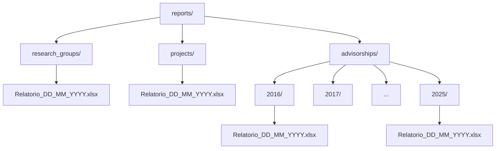

# Software Requirements Specification (SRS)
## Sigpesq Report Downloader Agent

### 1. Introduction

#### 1.1 Purpose
This document specifies the functional and non-functional requirements for the Sigpesq Report Downloader Agent, an automated system for downloading research reports from the IFES Sigpesq portal.

#### 1.2 Scope
The system automates the login process and downloads three categories of research reports (Research Groups, Research Projects, and Advisorships) from the Sigpesq portal, organizing them into a structured directory hierarchy.

#### 1.3 Definitions and Acronyms
- **SRS**: Software Requirements Specification
- **IFES**: Instituto Federal do Espírito Santo
- **Sigpesq**: Sistema de Gestão de Pesquisa (Research Management System)
- **CDP**: Chrome DevTools Protocol
- **MVC**: Model-View-Controller
- **SOLID**: Single Responsibility, Open-Closed, Liskov Substitution, Interface Segregation, Dependency Inversion

---

### 2. Functional Requirements

#### FR-1: User Authentication
**Priority**: High  
**Description**: The system shall authenticate users to the Sigpesq portal using CPF and password credentials.

**Acceptance Criteria**:
- System reads credentials from environment variables
- System handles CPF input mask correctly
- System verifies successful login before proceeding
- System provides error messages for failed authentication

#### FR-1.1: CLI Strategy Selection
**Priority**: Medium
**Description**: The system shall provide CLI commands to execute specific download strategies individually (Groups, Projects, Advisorships).

**Acceptance Criteria**:
- System accepts command line arguments to select strategy
- System supports `download-groups`, `download-projects`, `download-advisorships` commands
- System supports default `download-all` behavior

#### FR-2: Research Groups Report Download
**Priority**: High  
**Description**: The system shall download the "Grupos de Pesquisa" (Research Groups) report.

**Acceptance Criteria**:
- System navigates to the reports page
- System expands the Research Groups category
- System triggers the "Emitir" button
- System saves the report to `reports/research_groups/` directory
- System monitors download completion

#### FR-3: Research Projects Report Download
**Priority**: High  
**Description**: The system shall download the "Projetos de Pesquisa" (Research Projects) report.

**Acceptance Criteria**:
- System navigates to the reports page
- System expands the Research Projects category
- System triggers the "Emitir" button
- System saves the report to `reports/projects/` directory
- System monitors download completion

#### FR-4: Advisorships Report Download (Year-Based)
**Priority**: High  
**Description**: The system shall download "Orientações" (Advisorships) reports for each available year (2016-2025).

**Acceptance Criteria**:
- System identifies the "Ano Executado" dropdown
- System iterates through all available years
- System downloads one report per year
- System saves each report to `reports/advisorships/{year}/` directory
- System monitors download completion for each year

#### FR-5: Download Path Management
**Priority**: High  
**Description**: The system shall dynamically configure Chrome download paths for each report category.

**Acceptance Criteria**:
- System creates necessary directories if they don't exist
- System uses Chrome DevTools Protocol to set download paths
- System ensures files are saved to correct locations

#### FR-6: Download Monitoring
**Priority**: Medium  
**Description**: The system shall monitor file system changes to detect download completion.

**Acceptance Criteria**:
- System detects new files in target directories
- System identifies temporary `.crdownload` files
- System waits for download completion (max 60 seconds per report)
- System provides status updates during downloads

#### FR-7: Error Handling and Logging
**Priority**: Medium  
**Description**: The system shall handle errors gracefully and provide informative logging.

**Acceptance Criteria**:
- System captures screenshots on failures
- System logs all major operations
- System provides summary of successful/failed downloads
- System continues processing remaining reports after individual failures

---

### 3. Non-Functional Requirements

#### NFR-1: Performance
**Priority**: Medium  
**Description**: The system shall complete all downloads within a reasonable timeframe.

**Metrics**:
- Login: < 30 seconds
- Single report download: < 60 seconds
- Total execution time: < 10 minutes for all reports

#### NFR-2: Reliability
**Priority**: High  
**Description**: The system shall operate reliably in headless mode.

**Metrics**:
- Success rate: > 95% for individual downloads
- Retry mechanism for transient failures
- Graceful degradation on partial failures

#### NFR-3: Maintainability
**Priority**: High  
**Description**: The system shall follow SOLID principles and design patterns for easy maintenance.

**Metrics**:
- Strategy Pattern for extensibility
- Factory Pattern for object creation
- Clear separation of concerns (MVC)
- Comprehensive documentation (IEEE SDD)
- **Test Coverage**: Each strategy execution flow must be covered by unit tests mocking the WebDriver.

#### NFR-4: Usability
**Priority**: Medium  
**Description**: The system shall be easy to configure and execute.

**Metrics**:
- Simple `.env` configuration
- Single command execution
- Clear console output
- Organized directory structure

#### NFR-5: Portability
**Priority**: Medium  
**Description**: The system shall run on multiple platforms.

**Metrics**:
- Compatible with Linux, macOS, Windows
- Python 3.8+ support
- Chrome/Chromium compatibility

#### NFR-6: Security
**Priority**: High  
**Description**: The system shall handle credentials securely.

**Metrics**:
- Credentials stored in `.env` file (not in code)
- `.env` excluded from version control
- No credential logging

---

### 4. Use Cases

#### UC-1: Download All Reports
**Actor**: System Administrator  
**Preconditions**: 
- Valid Sigpesq credentials configured in `.env`
- Chrome/Chromium installed
- Internet connection available

**Main Flow**:
1. User executes `python3 agent.py`
2. System reads credentials from environment
3. System initializes Chrome WebDriver in headless mode
4. System navigates to Sigpesq login page
5. System enters CPF and password
6. System clicks login button
7. System verifies successful authentication
8. System navigates to reports page
9. For each report category:
   - System expands category section
   - System configures download directory
   - System clicks "Emitir" button
   - System monitors download completion
10. System displays download summary
11. System closes browser

**Postconditions**: All reports downloaded to `reports/` directory

**Alternative Flows**:
- **AF-1**: Login fails → System logs error and exits
- **AF-2**: Individual download fails → System logs error, captures screenshot, continues with next report
- **AF-3**: Network timeout → System retries operation (up to 3 times)

#### UC-2: Download Advisorships by Year
**Actor**: System  
**Preconditions**: Successfully logged in to Sigpesq

**Main Flow**:
1. System navigates to reports page
2. System expands "Orientações" section
3. System locates "Ano Executado" dropdown
4. System retrieves list of available years
5. For each year:
   - System creates directory `reports/advisorships/{year}/`
   - System selects year in dropdown
   - System configures download path
   - System clicks "Emitir" button
   - System waits for download completion
6. System logs summary of year-based downloads

**Postconditions**: One report per year saved in separate directories

---

### 5. System Architecture

#### 5.1 High-Level Architecture

#### 5.2 Class Diagram

#### 5.3 Deployment Diagram

#### 5.4 Activity Diagram - Download Process

---

### 6. Data Model

#### 6.1 Directory Structure

---

### 7. Constraints and Assumptions

#### 7.1 Constraints
- System requires Chrome/Chromium browser
- System requires Python 3.8 or higher
- System requires active internet connection
- System depends on Sigpesq portal structure (HTML IDs, URLs)

#### 7.2 Assumptions
- Sigpesq portal maintains consistent HTML structure
- Report file names follow consistent naming pattern
- All reports are downloadable as Excel files
- Year dropdown contains years 2016-2025

---

### 8. Future Enhancements

1. **Scheduled Execution**: Add cron job support for automated periodic downloads
2. **Email Notifications**: Send email alerts on completion or failures
3. **Report Parsing**: Extract and analyze data from downloaded reports
4. **Multi-User Support**: Support multiple credential sets for batch processing
5. **GUI Interface**: Develop graphical interface for non-technical users
6. **Cloud Storage**: Integrate with cloud storage (S3, Google Drive) for backup
7. **Incremental Downloads**: Only download new/updated reports
8. **Report Validation**: Verify downloaded file integrity and content
